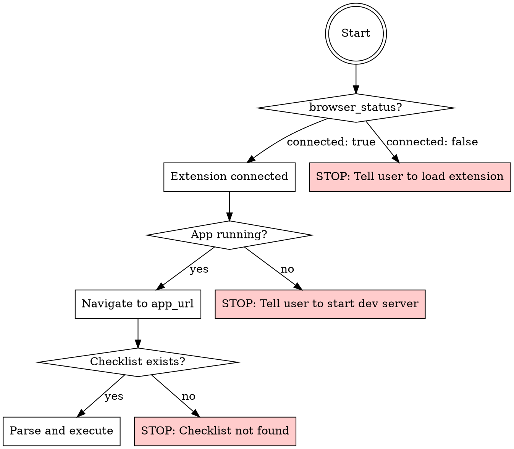

# QA Runner

Executes structured QA checklists against a running app using Browser Bridge MCP tools. Reads a checklist markdown file with YAML frontmatter and CSS selectors, drives the browser through each scenario, captures evidence (screenshots, console logs, content checks), and reports pass/fail results.

## When to Use

- User says "run QA" or "qa check"
- User says "test checklist" or "run checklist"
- User wants to execute a QA checklist against a live app

## When NOT to Use

- Running unit tests or E2E test suites (use the project's test runner)
- Writing new tests

## Prerequisites Check

Before running any scenario, verify ALL of these:



### Step 1: Check browser connection

Call `browser_status`. If `connected: false`, stop and tell the user:

> Chrome extension is not connected. Please:
> 1. Open `chrome://extensions` and ensure "Browser Bridge MCP" is enabled
> 2. Click the extension icon and verify it shows "Connected"
> 3. If disconnected, click "Reconnect"

### Step 2: Locate the checklist

Search the project for checklist markdown files. Common locations:

```
docs/qa/checklists/
qa/checklists/
tests/checklists/
```

If the user specifies a file path or requirement ID, use that directly. Read the file. If it has no YAML frontmatter with `automation: claude-qa`, warn the user that the checklist isn't formatted for automation and offer to run it in guided-manual mode instead.

### Step 3: Verify app is running

Navigate to the `app_url` from the checklist frontmatter. If navigation fails or the page is blank, stop and tell the user to start their dev server.

## Checklist Format

Checklists that support automation have this structure:

```yaml
---
title: Create New Item
app_url: http://localhost:3000
preconditions:
  - logged_in: true
  - start_route: /dashboard
automation: claude-qa
---
```

Steps reference CSS selectors after an arrow:

```
1. Click the create button → `[data-testid="create-button"]`
2. Fill in the title → `[data-testid="title-input"]` with "My Item"
3. Click save → `#save-btn`
```

Verify items specify the check method:

```
- [ ] `screenshot` Item appears in the list
- [ ] `console_check` No errors in console
- [ ] `content_check` Page contains "My Item"
- [ ] `evaluate` document.querySelector('.item-count').textContent === '1'
```

## Selector Conventions

Use whatever selectors the project provides. Common patterns by framework:

| Framework | Preferred Selector |
|-----------|-------------------|
| React / Vue / Svelte | `[data-testid="foo"]` |
| React Native Web / Expo | `[data-testid="foo"]` (rendered from `testID`) |
| Angular | `[data-cy="foo"]` or `[data-testid="foo"]` |
| Plain HTML | `#id`, `.class`, or semantic selectors |

If a project uses `testID`, `data-cy`, or another convention, adapt accordingly.

### Filling inputs in React-based apps

React controls input state internally. Use `browser_fill` which handles this automatically via native property setters. If that doesn't work, fall back to `browser_evaluate`:

```js
const el = document.querySelector('[data-testid="title-input"]');
const setter = Object.getOwnPropertyDescriptor(window.HTMLInputElement.prototype, 'value').set;
setter.call(el, 'New Value');
el.dispatchEvent(new Event('input', { bubbles: true }));
el.dispatchEvent(new Event('change', { bubbles: true }));
```

## Execution Flow

For each scenario in the checklist:

### Execute Steps

Map each step to a browser tool call based on its action verb and selector:

| Action | Browser Tool | Example |
|--------|-------------|---------|
| Navigate to | `browser_navigate` | Go to a URL or route |
| Tap / Click | `browser_click` | `[data-testid="save-button"]` |
| Enter / Fill / Type | `browser_fill` | `[data-testid="title-input"]` with value |
| Verify / Check | `browser_get_content` | Look for text content |
| Wait for | `browser_wait_for` | Wait for element to appear |
| Scroll to | `browser_evaluate` | `element.scrollIntoView()` |

### Execute Verify Items

For each verify item, run the appropriate check:

- **`screenshot`**: Call `browser_screenshot`. Visually inspect the result. Report what you see.
- **`console_check`**: Call `browser_get_console`. Check for errors (level: "error"). Warnings are acceptable.
- **`content_check`**: Call `browser_get_content` with `format: "text"`. Search for expected text.
- **`evaluate`**: Call `browser_evaluate` with the JS expression. Check return value.

### Record Results

After each scenario, record:
- **Pass**: All verify items confirmed
- **Fail**: One or more verify items failed (include which ones and why)
- **Blocked**: Could not execute steps (include the blocking reason)

## Reporting

After all scenarios complete, output a summary table:

```
## QA Results: [Checklist Title]

| Scenario | Result | Notes |
|----------|--------|-------|
| S1: Create item with all fields | PASS | All verifications confirmed |
| S2: Minimum fields | PASS | Item created with title only |
| S3: Validation errors | FAIL | Save button not disabled (see screenshot) |
| S4: Default state | PASS | Defaults confirmed |

**Overall: 3/4 PASS | 1 FAIL**
```

Then ask the user if they want to:
1. Re-run failed scenarios
2. Update the checklist file with results

## Updating Results

If the user says yes to updating the checklist, replace status markers for each scenario:
- `✅ Pass` for passing scenarios
- `❌ Fail` for failing scenarios
- `🚫 Blocked` for blocked scenarios

Fill in any QA notes section with the date, tester ("automated via Browser Bridge"), and findings.

## Error Recovery

- **Element not found**: Wait 3 seconds with `browser_wait_for`, retry once. If still missing, mark step as failed and continue to next scenario.
- **Navigation timeout**: Retry navigation once. If still failing, mark scenario as blocked.
- **Console errors during test**: Log them but don't auto-fail unless the verify item specifically checks for console errors.
- **Screenshot fails**: Note it in results, continue execution. Tab must be visible for screenshots.
